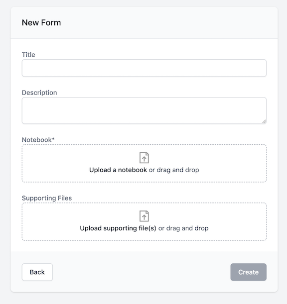
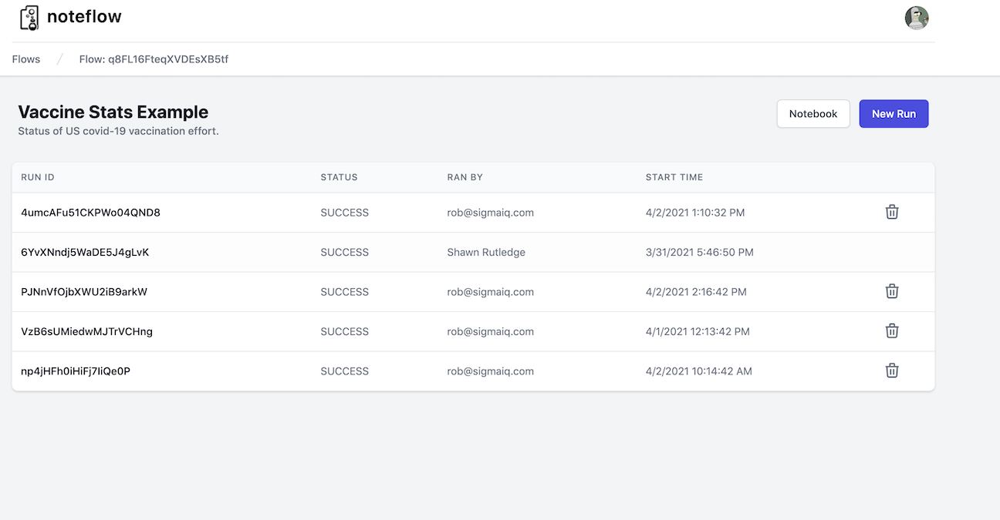

# Welcome to NoteFlow

Simply document your inputs and outputs, and NoteFlow executes your Jupyter Notebook as a **serverless cloud-function**, which can be run manually, or via API (*coming soon*).

- [How Does It Work](#how-does-it-work)
  - [I/O Types](#io-types)
  - [Installing Packages](#installing-packages)
  - [Exporting Files](#exporting-files)
- [Uploading Notebooks](#uploading-notebooks)
- [Running Notebooks](#running-notebooks)
- [Reporting Bugs & Issues](#reporting-bugs-issues)

## How Does It Work?
A notebook’s first code cell is used to document inputs and outputs. You can specify an input/output's type, as well as a friendly description.  
  
- The first code cell is special and documents the noteflow inputs and outputs via formatted comments.
- However, it is arbitrary code and can be used in anyway you like for local development and testing. It is overwritten in production with values provided from the user.
  
  
The I/O comment spec has three parts:
- input/ouput: marks variable as an input or output
- type: I/O is typed (for the underlying API). Types are: `string, number, boolean, filepath, and dirpath`
- description: The rest of the comment becomes the prompt/description for the field in the generated App.
  
For example:


```
string_var = 'foo'                 #input  string    A string input    
num_var = None                     #input  number    A numeric input       
report_file = '/report.csv'        #output filepath  The name of a file to export    
```

### I/O Types

Input/Output supports the following types: `string, number, boolean, filepath, and dirpath`

* `inputVar = None                 #input   [string, number, filepath]    Description`
* `outputVar = None                #output  [string, number, filepath]    Description`

### Installing Packages:

To import packages, use `%pip install` or `-r requirements.txt` inside a code cell. You can upload requirement files when you publish your notebook.

Currently, we automatically install the following packages: `numpy, scipy, pandas, and matplotlib`

### Exporting Files

To export a file from a notebook, first document your output in the notebook's first cell block [see above](#how-does-it-work). Throughout the course of your notebook, simply save a file to the filepath specified in your I/O documentation and we will do the rest.

For example:

```
# first cell    
chart_file = '/chart.png'				  #output filepath  The name of a file to export    
# ...later in the notebook           
figure = my_dataframe.plot().get_figure()   
figure.savefig(chart_file)     
```

## Uploading Notebooks

To create a new flow, first document your inputs and outputs in the first code cell of your notebook [see above](#how-does-it-work). Note: you must be logged-in to create a new flow.

Once your notebook has been prepped, simply navigate to the [home screen](https://noteflow.app/) and select **New Flow**. 

Then, enter information about the notebook into the New Flow form, and upload your Jupyter notebook as directed.

 

Upload any supporting files (for example, a requirements.txt file) and select **Create**. 

Now you're ready to execute your noteboook.

## Running Notebooks
On the [home screen](https://noteflow.app/) you will see a list of your existing flows. Select the flow you would like to run. This will take you to the **flow history** page.

 

From here, select **New Run**, enter the required inputs when prompted, and then select **Run**

Results will be displayed when the notebook has finished executing.

## Reporting Bugs & Issues

Please send any bugs or questions / feature requests to support@noteflow.io

